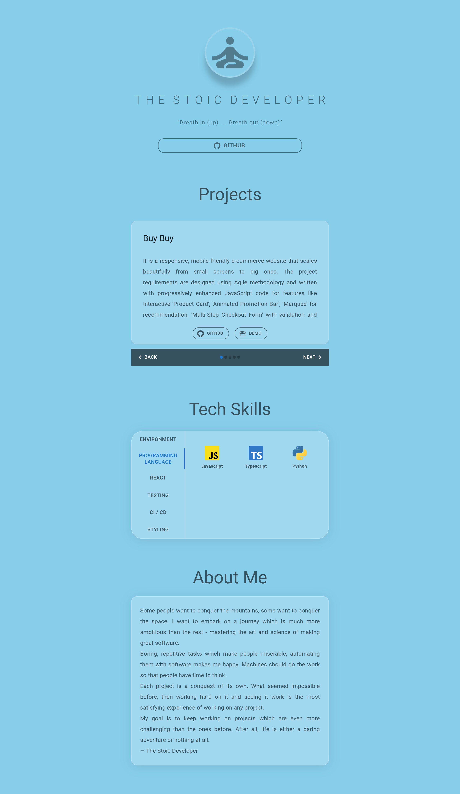
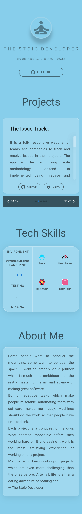

# portfolio

## Table of Contents

- [About](#about)
- [Features and Stack](#features-and-stack)
- [Screenshots](#screenshots)
- [Getting Started](#getting-started)
- [Future Work](#challenges)
- [Create React App](#bootstrapped-with-create-react-app)

## About

**Portfolio** is a mobile friendly website to showcase projects and techstack of user. 

## Features and Stack

### Features

- Fully responsive with support for mobile, tablet and desktop device to increase traffic.
- Project Carousel to describe and demo projects.
- Skills Tab to show tech skills in compressed way.
- documented for code maintainability.
- fully automated CI / CD pipeline implemented with github and github actions.
- deployed and hosted in firebase.

### Stack

- React
- Typescript
- Material UI
- Firebase
- Github
- Github actions

## Screenshots

- Landing Page (desktop view)




- Landing Page (mobile view)




## Getting started

Below you'll find the instructions for setting up the project locally

### Clone repo and install dependencies

```bash
# Clone the repo
git clone https://github.com/neuralchemist/portfolio.git

# Install dependencies
cd portfolio
npm install
```


### Start the app

```bash
# Start development server
npm start
```

The app should be running at: [http://localhost:3000](http://localhost:3000/)

## Future Work

- add tech stack svg icons for each project to project description. 
- add skeletons while loading.

These are some of the features I want to implement in future


## Bootstrapped with Create React App

This project was bootstrapped with [Create React App](https://github.com/facebook/create-react-app).

For the detailed description of available scripts see [CRA Documentation](https://create-react-app.dev/docs/available-scripts)

